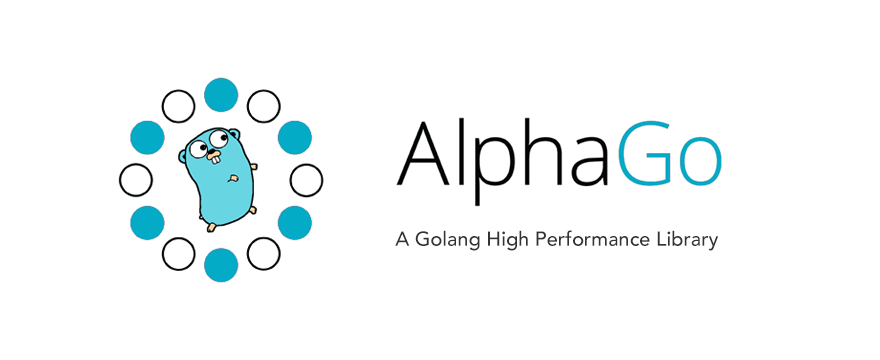

# AlphaGo

[](https://travis-ci.org/wgliang/alphago)
[](https://codecov.io/gh/wgliang/alphago)
[](https://goreportcard.com/report/github.com/wgliang/alphago)
[](https://godoc.org/github.com/wgliang/alphago)
[](http://www.apache.org/licenses/LICENSE-2.0.html)

## Introduction

AlphaGo is a much more powerful Golang library than official's.

## Basic Usage

### Installation

```go
go get github.com/wgliang/alphago
```
## ToDo List

- sort(map,array,slice)
- version tag
- timewheel
- encrypt and decode
- cache algorithm
- math
- block

## Contributing

If you have a good idea, a better, faster or more secure function implementation, welcome to [PR](https://github.com/wgliang/alphago/pulls) and [Issue](https://github.com/wgliang/alphago/issues).

## Credits

Logo is designed by [Ri Xu](https://xuri.me)
